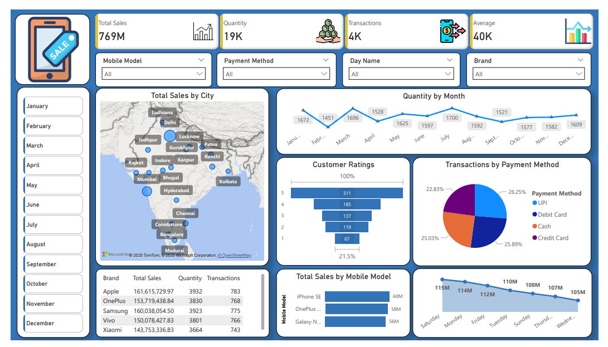

# 📱 Mobile Sales Performance Dashboard (Power BI)
## 📝 Project Overview
This Power BI dashboard provides a dynamic and insightful look into mobile sales performance across India, helping users explore brand-wise performance, customer feedback, sales by city, and key transaction metrics. It highlights how top brands like Apple, Samsung, and OnePlus are competing — and how their sales vary across models, months, and regions.

Whether you're tracking brand performance, exploring market trends, or just showcasing your Power BI skills — this dashboard delivers powerful insights in a clean, interactive format.

## 🛠️ Tech Stack / Tools Used
Microsoft Power BI

DAX formulas for calculated fields and KPIs

Slicers to filter data by month, brand, city, model, and more

Charts: Line, Bar, Funnel, and Pie for data visualization

Map Visuals to display sales by geography

Cards & KPIs to show totals like Sales, Quantity, Transactions

Buttons & Bookmarks for navigation

Custom Icons & Images for enhanced design

# 🌟 Features & Highlights
✅ City-wise Sales Mapping: Easily spot top-selling regions using the India map with real-time data points
🧑‍💼 Brand Competition Overview: Instantly compare Motorola with competitors like Apple, Samsung, Vivo, etc.
🎯 Monthly Quantity Trends: Understand sales fluctuations month over month with clean line charts
📈 Interactive Visuals: Filter and drill down into any data point with slicers and clickable visuals
🧩 Payment Insights: See how customers prefer to pay — via UPI, card, or cash
🤖 Dashboard Navigation: Use built-in buttons for smooth transitions between views
📉 Customer Feedback Funnel: Track customer ratings and satisfaction visually

# 📂 File Info
This project is built entirely in Power BI Desktop (.pbix) format and uses a mix of DAX measures, slicers, and custom visuals to deliver a fluid user experience.

# ⚠️ Note
To ensure full interactivity, use the dashboard in Power BI Desktop or Power BI Service (if published). Filters, slicers, and buttons are fully functional only in these environments.

# 🖼️ Preview
📷 Dashboard Preview (Mobile Sales Across India)

💬 Want to Know More?
If you're curious about how this dashboard was built or looking to create something similar for your own data — feel free to connect!

